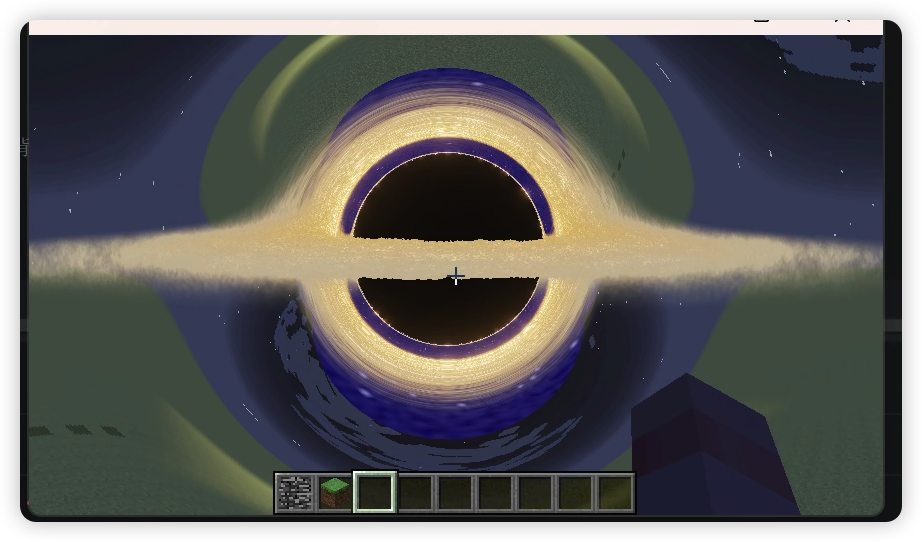

# 黑洞渲染演示

一个 Minecraft 1.7.10 模组，展示实时黑洞渲染与引力透镜效果。

## 特性

- **基于物理的黑洞渲染** - 使用光线步进算法
- **引力透镜效果** - 光线在黑洞周围弯曲，扭曲背后的 Minecraft 世界
- **吸积盘** - 体积渲染与动态噪声动画
- **HDR Bloom 后处理** 管线
- **ACES 色调映射** - 电影级视觉效果

## 截图

## 工作原理

### 光线步进 (Ray Marching)

黑洞使用光线步进算法渲染。对于屏幕上的每个像素，从相机发射一条光线并在空间中逐步前进。光线的方向会根据广义相对论近似被黑洞引力弯曲。

### 引力透镜

当光线逃离黑洞的引力影响后，使用弯曲后的方向采样 Minecraft 世界的帧缓冲。这创造了特征性的"爱因斯坦环"扭曲效果，世界看起来在黑洞周围变形。

### 吸积盘

黑洞周围发光的圆盘使用体积渲染。当光线穿过圆盘区域时，根据以下因素累积颜色和不透明度：
- 到黑洞中心的距离
- 程序化噪声产生粒子状外观
- 基于温度的颜色渐变（内部区域更热/更亮）

### 后处理管线

1. **黑洞渲染** 到 HDR 帧缓冲
2. **亮度提取** 用于泛光
3. **Bloom 降采样**（6 次迭代）
4. **Bloom 上采样** 与加法混合
5. **合成** 原始图像 + 泛光
6. **ACES 色调映射** + 伽马校正
7. **最终合成** 到屏幕

## 使用方法

1. 在世界中放置黑洞方块
2. 黑洞会在放置的方块上方 3 格处渲染
3. 从不同角度观察以查看引力透镜效果

## 致谢

基于 [Blackhole](https://github.com/user/Blackhole) OpenGL 演示移植到 Minecraft，并添加了额外功能：
- Minecraft 世界集成与引力透镜
- 完整的 HDR Bloom 管线
- 基于 TileEntity 的渲染

## 技术细节

- **着色器版本**: GLSL 330 core
- **光线步进次数**: 最多 300 次迭代
- **Bloom 迭代**: 6 级
- **HDR 格式**: RGBA16F
